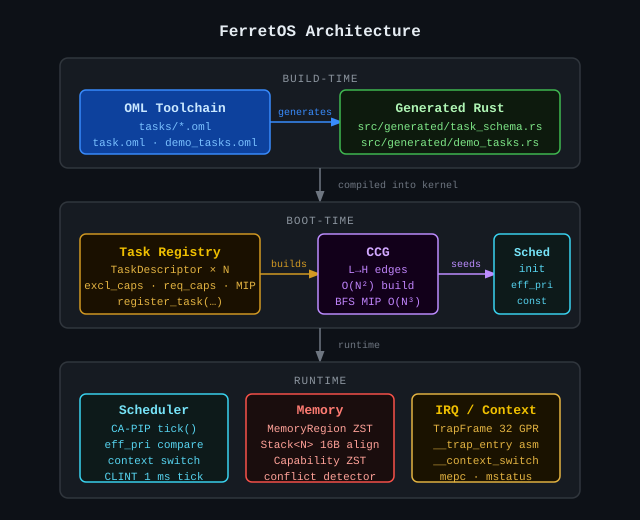

# FerretOS


A `no_std` Rust microkernel for RISC-V systems with ≤256 KB RAM and no MMU. Memory safety is enforced by the type system. Priority inversion is structurally impossible via a proactive capability-aware scheduler.

---

## What is FerretOS?

Most embedded RTOSes are written in C. Most memory-safe kernels are too large for constrained hardware. FerretOS targets the gap: a microkernel where the Rust type system enforces memory isolation at compile time, and the scheduler eliminates priority inversion by construction rather than by detection.

Two technical contributions drive the design:

**Capability system.** Hardware peripherals are represented as zero-sized types (ZSTs). Exclusive ownership is enforced at compile time with zero runtime cost. A boot-time conflict detector validates the capability declarations of all registered tasks before any task runs, halting with a diagnostic if two tasks claim the same exclusive peripheral.

**CA-PIP scheduler.** At boot, the kernel constructs a Capability Contention Graph (CCG) from the static task registry. An edge L → H in the CCG means task L holds a peripheral that task H requires. For each task, the kernel computes `MaxInheritedPriority` — the highest base priority of any task reachable from it via BFS over the CCG — and stores it in the task descriptor. The scheduler's preemption decision is then:

```
effective_priority(T) = max(T.base_priority, T.max_inherited_priority)
```

This value is constant for the system's lifetime. Priority inversion is structurally impossible: a holder's effective priority is always at least as high as every waiter's priority, so it cannot be preempted by a waiter. No graph traversal occurs at runtime — the preemption check is two integer comparisons.

For full design rationale, algorithm proofs, and ecosystem positioning, see [FERRET.md](FERRET.md).

---

## Status

| Sprint | Theme | Status |
|--------|-------|--------|
| 0 | Toolchain + QEMU boot | ✅ Complete |
| 1 | Interrupts + context switch | ✅ Complete |
| 2 | Memory safety layer | ✅ Complete |
| 3 | Capability system | ✅ Complete |
| 4 | CA-PIP scheduler | ✅ Complete |
| 5 | OML integration | ✅ Complete |
| 6 | Polish + demo | 🔲 Pending |

---

## Target Platform

| Property | Value |
|----------|-------|
| ISA | RISC-V RV32IMAC |
| RAM | ≤ 256 KB |
| Flash | ≤ 512 KB |
| MMU | None |
| Emulator | QEMU `virt` (riscv32) |
| Rust target | `riscv32imac-unknown-none-elf` |
| Toolchain | `nightly-2024-12-01` (pinned via `rust-toolchain.toml`) |

---

## Architecture



```
Boot sequence:
  1. UART init + memory map print
  2. Task registration (TaskDescriptor array, static stacks)
  3. Capability conflict detection (halts on exclusive cap clash)
  4. CCG construction from task registry
  5. MaxInheritedPriority computed via BFS, written to each TaskDescriptor
  6. Ready queue populated; highest effective-priority task selected
  7. CLINT timer armed; machine-mode interrupts enabled
  8. Timer ISR fires every 1 ms → preemption check → context switch if needed

Kernel modules:
  memory/
    region.rs   — MemoryRegion<START, END>: ZST with compile-time non-overlap check
    stack.rs    — Stack<N>: 16-byte aligned, statically allocated
    task.rs     — TaskDescriptor, TaskState, TASK_REGISTRY, register_task()

  capability/
    types.rs    — UartCapability<N>, GpioCapability<PIN>, SpiCapability<N>, I2cCapability<N>
    wrappers.rs — ExclusiveCapability<T> (non-Clone), SharedCapability<T> (Clone)
    allocator.rs — check_capability_conflicts(): boot-time scan, halt on conflict

  scheduler/
    ccg.rs      — CapabilityContentionGraph::build(): O(N²) from exclusive/required masks
    mip.rs      — compute_and_store_mip(): BFS from each task, writes MIP to registry
    queue.rs    — PriorityQueue<N>: static max-heap, O(log N) insert/pop
    mod.rs      — init(), tick(): preemption check + round-robin tie-breaking

  context/
    mod.rs      — TrapFrame: 32 GPRs + mepc/mstatus/mcause/mtval (#[repr(C)])
    switch.rs   — __context_switch: saves/restores callee-saved regs + CSRs
    trap.rs     — __trap_entry: full register save, timer ISR dispatch

  clint.rs      — get_mtime(), set_mtimecmp(), schedule_tick(), TICK_CYCLES = 10_000
  uart.rs       — 16550 MMIO driver (0x1000_0000)
  config.rs     — MAX_TASKS = 16, MAX_PERIPHERALS = 32
```

### CA-PIP 3-Task Demo (Sprint 4)

The boot sequence registers three tasks that demonstrate the CA-PIP guarantee:

| Task | Base Priority | Role |
|------|--------------|------|
| L (id=0) | 1 | Holds UART0 exclusively; does slow work |
| M (id=1) | 2 | CPU-bound; no capability contention |
| H (id=2) | 3 | Requires UART0; prints timestamps |

CCG has one edge: L → H (L holds UART0, H requires it).

`MIP(L) = priority(H) = 3`, so `effective_priority(L) = max(1, 3) = 3`.

L cannot be preempted by M (eff_pri 3 > M.base_priority 2). H runs as soon as L releases UART0. M cannot delay H via L.

---

## Prerequisites

- **Rust nightly** — managed automatically by `rustup` via `rust-toolchain.toml`
- **QEMU with RISC-V support**
  ```bash
  brew install qemu          # macOS
  apt-get install qemu-system-misc  # Debian/Ubuntu
  ```

### Cloning

The OML transpiler is included as a git submodule at `oml/`. Clone with:

```bash
git clone --recurse-submodules https://github.com/Bilal-Waraich/FerretOS

# Or if you already cloned without submodules:
git submodule update --init
```

---

## Build and Run

```bash
# Build release binary
cargo build --release

# Run in QEMU
./scripts/run_qemu.sh
# Press Ctrl-A X to exit QEMU

# Check binary fits within flash and RAM budgets
./scripts/size_report.sh

# Lint (zero-warning policy)
cargo clippy -- -D warnings
```

### Expected boot output

```
====================================
  Ferret booting...
====================================
FerretOS v0.1.0 — Sprint 5 (OML integration)
Target : riscv32imac-unknown-none-elf
Machine: QEMU virt
Memory map:
  .text start : 0x80000000
  ...
Task registry:
  task 0  base_pri=1  mip=3  eff_pri=3  excl_caps=0x1  req_caps=0x0  mem=[0x80081000, 0x80082000)
  task 1  base_pri=2  mip=0  eff_pri=2  excl_caps=0x0  req_caps=0x0  mem=[0x80082000, 0x80083000)
  task 2  base_pri=3  mip=0  eff_pri=3  excl_caps=0x0  req_caps=0x1  mem=[0x80083000, 0x80084000)
Scheduler initialised.
Interrupts enabled. Running demo.
[TICK 1]
counter: 100000
[TICK 2]
...
```

Task L's `eff_pri=3` in the registry output confirms that MIP inheritance is working correctly.

---

## Debug (GDB)

```bash
# Terminal 1 — start QEMU with GDB stub
./scripts/run_qemu.sh --gdb

# Terminal 2 — attach GDB
./scripts/gdb_attach.sh
```

---

## Design Decisions

### Why no heap

All kernel data structures are statically allocated at link time. `MAX_TASKS` and `MAX_PERIPHERALS` are `const` values in `config.rs` that bound every fixed-size array in the kernel. No `alloc` crate, no `Box`, no `Vec`. This eliminates allocator bugs, heap fragmentation, and OOM conditions at runtime — and makes Worst-Case Execution Time (WCET) analysis tractable.

### Why ZST capabilities

Zero-sized types impose capability constraints at the type level with zero runtime cost. `size_of::<ExclusiveCapability<T>>() == 0` for any `T`. Rust's move semantics make it impossible to hand the same `ExclusiveCapability` instance to two tasks. The boot-time conflict detector validates the bitmask representation of these declarations before any task runs.

### Why CCG over per-resource ceilings

SRP (used by RTIC) asks "what is the ceiling of this resource?" CA-PIP asks "what is the maximum priority of any task reachable from this task via the full contention graph?" For non-overlapping resource graphs (typical on constrained targets) the answers converge. CA-PIP's BFS over the CCG catches multi-hop dependency chains that per-resource ceilings miss. See [FERRET.md §CA-PIP and SRP](FERRET.md#ca-pip-and-srp-mathematical-relationship) for the formal relationship.

### `required_cap_mask` vs. `exclusive_cap_mask`

These two bitmask fields are distinct by design. `exclusive_cap_mask` means "this task currently holds this peripheral." `required_cap_mask` means "this task needs this peripheral to proceed." CCG edges are built from `L.exclusive & H.required != 0`, not from two tasks sharing the same exclusive bit. This keeps the boot-time conflict detector (which halts on double-exclusive-claim) and the CCG builder (which models holder–waiter relationships) from interfering.

---

## Ecosystem Position

| | **FerretOS** | RTIC | Hubris | Tock OS |
|---|---|---|---|---|
| Language | Rust | Rust | Rust | Rust |
| Model | Microkernel | Concurrency framework | Microkernel | Kernel + processes |
| Memory isolation | Rust type system | Rust lifetimes | ARM MPU | ARM MPU |
| Scheduling | CA-PIP (proactive CCG) | SRP (compile-time ceilings) | Fixed / synchronous | Preemptive |
| Priority inversion | Structurally impossible | Structurally impossible | N/A | Runtime mitigation |
| Task configuration | OML DSL (Sprint 5) | Rust proc-macros | Static config | Dynamic sideloading |
| RAM target | ≤ 256 KB | Zero-cost | ~2000 LOC kernel | ~64 KB |
| MMU required | No | No | No | No |

**FerretOS vs. RTIC** — closest technical sibling. Both are proactive, both use static resource declarations. RTIC is a concurrency framework built on bare-metal ISRs; FerretOS adds a full microkernel abstraction with explicit task lifecycle, typed memory regions, and a hardware-agnostic capability layer.

**FerretOS vs. Hubris** — both reject dynamic task creation and operate on a fully static system image. Hubris mandates ARM MPU for isolation; FerretOS targets hardware that may lack MPU capabilities entirely, with RISC-V PMP as an optional hardening layer.

---

## Repository Layout

```
FerretOS/
├── kernel/src/
│   ├── main.rs           — boot sequence, OML-generated task registration
│   ├── config.rs         — MAX_TASKS, MAX_PERIPHERALS
│   ├── generated/        — OML transpiler output (committed; no OML required to build)
│   │   ├── task_schema.rs — TaskConfig struct generated from task.oml
│   │   ├── demo_tasks.rs  — TASK_L/M/H statics generated from demo_tasks.oml
│   │   └── bridge.rs      — TaskConfig::into_descriptor (hand-written bridge)
│   ├── memory/           — MemoryRegion, Stack, TaskDescriptor, TASK_REGISTRY
│   ├── capability/       — ZST types, wrappers, boot-time conflict detector
│   ├── scheduler/        — CCG, MIP, PriorityQueue, preemption logic
│   ├── context/          — TrapFrame, __context_switch, __trap_entry
│   ├── clint.rs          — CLINT timer driver
│   └── uart.rs           — 16550 UART driver
├── tasks/
│   ├── task.oml          — TaskConfig schema (struct + Peripheral enum)
│   └── demo_tasks.oml    — TASK_L, TASK_M, TASK_H instance declarations
├── oml/                  — OML transpiler submodule (pinned commit)
├── linker/ferret.ld      — FLASH @ 0x8000_0000 / RAM @ 0x8008_0000
├── scripts/
│   ├── run_qemu.sh       — launch QEMU (--gdb adds GDB stub)
│   ├── size_report.sh    — assert .text+.rodata ≤ 512 KB, .data+.bss ≤ 256 KB
│   └── gdb_attach.sh     — attach riscv32-unknown-elf-gdb to QEMU
├── FERRET.md             — full design document, algorithm proofs, ecosystem analysis
├── CLAUDE.md             — contributor and AI assistant workflow guide
└── rust-toolchain.toml   — pinned nightly-2024-12-01
```

---

## Known Authoritative Constants

| Constant | Value |
|----------|-------|
| UART base | `0x1000_0000` |
| CLINT base | `0x0200_0000` |
| `mtimecmp` | `0x0200_4000` |
| Flash origin | `0x8000_0000` |
| RAM origin | `0x8008_0000` |
| Timer tick | 1 ms (TICK_CYCLES = 10,000 at 10 MHz) |
| Time quantum | 5 ticks (5 ms) |
| Stack alignment | 16 bytes (RISC-V ABI) |
| Context switch budget | ≤ 1,000 cycles (logged and warned if exceeded) |
